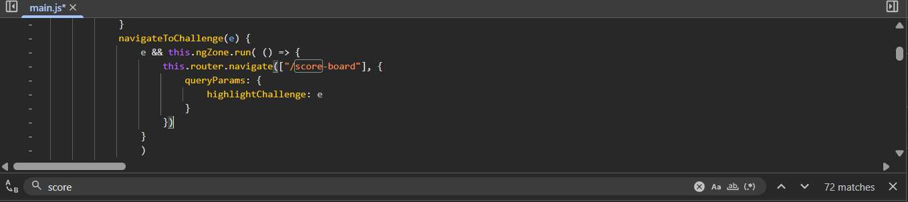
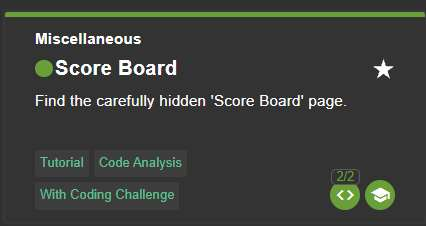

# Challenge 1: Find Scoreboard

**Category:** Miscellaneous  
**Severity:** Low

## Reason
Hidden route with no auth check, but exposed data has no damage potential.

## Methodology

Opened dev tools and looked through `main.js`. Pressed `Ctrl+F` and searched for `"score"`.

Found the path hardcoded. Appended `/score-board` to the existing URL.

Final URL: `http://localhost:3000/#/score-board`

## Vulnerability Explanation

The application relies on security through obscurity as the only protection to sensitive routes. As there are no server-side checks on who accesses what, one can easily review code and find all the hidden paths. The angular route table is bundled inside `main.js`, a client side file accessible to anyone, and the `/score-board` path is hardcoded as a string within it.

## Impact

Attackers can review client-side bundles to enumerate all application routes including admin panels, debug pages, and internal tools which were never linked to UI. This passive recon requires no authentication and leaves no server-side trace, giving an attacker a full map of the application's attack surface to pursue their further attacks.
