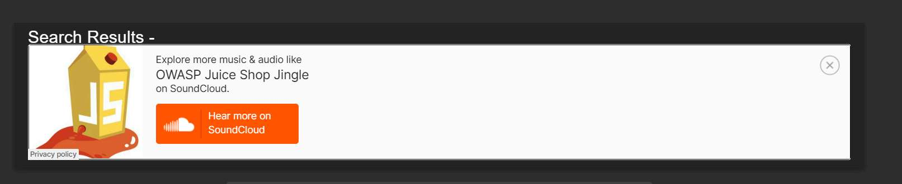

# Challenge 2: DOM XSS

**Category:** XSS  
**Severity:** High

## Reason
Reflected XSS on user-facing surface enabling session hijacking.

## Methodology

In the search bar, searched the following payload:

```
<iframe src="javascript:alert('xss')">
```

The alert fired. In dev tools, identified:

- **Sink:** `this.sanitizer.bypassSecurityTrustHtml(queryParam)`
- **Source:** `this.route.snapshot.queryParams.q`



## Vulnerability Explanation

 The application passes user-supplied input from the URL query parameter directly into `bypassSecurityTrustHtml()`, which explicitly disables built-in sanitization. It's meant for cases where you as a developer are injecting known-safe HTML, like a trusted CMS output or internal static content. Applying this to untrusted user input causes severe XSS security risks. If the function receives malicious payload, it is rendered as html content rather than plain text. Here, an iframe tag is used to embed another html document in the current page. The browser executes the JavaScript URL in the `iframe`'s src attribute in the context of the current page .

## Impact

 Attackers can craft malicious `html` and inject it in search bar, access `document.cookie` to steal session tokens, allowing them to hijack user’s account without needing credentials. Data stored in `localStorage` or `sessionStorage` can be read and exfiltrated. Also, the malicious script can make authorised requests like changing password, updating email addresses and making payments. Attackers can also manipulate DOM to change the contents of the page. 