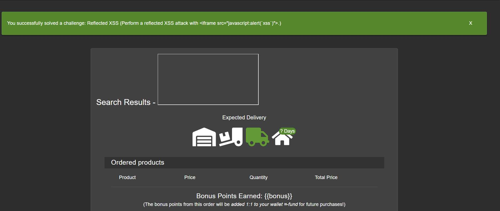

# Challenge 3: Bonus Payload

**Category:** XSS  
**Severity:** High

## Reason
Reflected XSS embedding external content which enables phishing on product pages.

## Methodology

The search bar is vulnerable to XSS. Searched the following iframe payload:

```
<iframe width="100%" height="166" scrolling="no" frameborder="no" allow="autoplay" src="https://w.soundcloud.com/player/?url=https%3A//api.soundcloud.com/tracks/771984076&color=%23ff5500&auto_play=true&hide_related=false&show_comments=true&show_user=true&show_reposts=false&show_teaser=true"></iframe>
```

It got reflected in the browser. The `allow` attribute is set to `autoplay`, which plays the music without user interaction.



## Vulnerability Explanation

The root cause is identical to DOM XSS, the application passes user-supplied input into `bypassSecurityTrustHtml()`, rendering it as `HTML` instead of plain text. In this case, the iframe tag embeds the external content, and src element tells it which content it must embed. 

## Impact

Since the iframe element allows embedding external content directly into the page, attackers can include external login forms or attacker-controlled pages that mimic legitimate login forms and perform phishing attacks to steal credentials.
