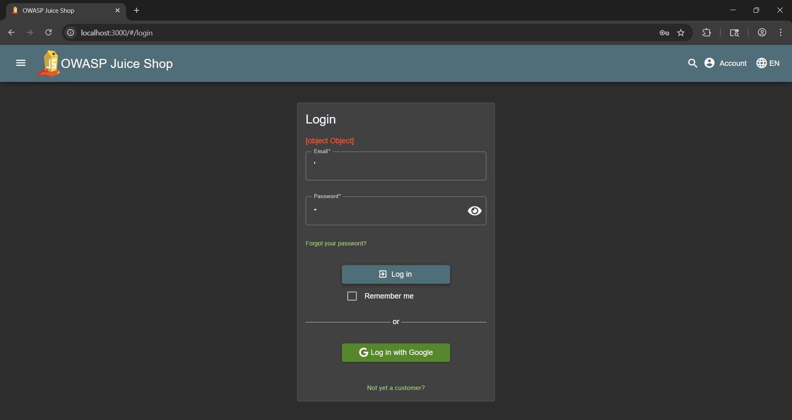

# Challenge 4: Reflected XSS

**Category:** XSS  
**Severity:** High

## Reason
URL-based XSS requires victim interaction which enables cookie theft and malicious redirects.

## Methodology

Created a dummy account, logged in, entered a dummy address and credit card, and placed an order. Went to the track-order endpoint and observed the URL controlling the order ID on screen.

Original URL: `http://localhost:3000/#/track-result?id=c7c3-87af5f6e3c405cf7`

In place of the ID, entered:

```
<iframe src="javascript:alert(`xss`)">
```

New URL:
`http://localhost:3000/#/track-result?id=%3Ciframe%20src%3D%22javascript:alert(%60xss%60)%22%3E`

Reloaded the page and the code executed.



## Vulnerability Explanation

In reflected XSS vulnerability, the injected html/js code is sent to the server. The server echoes it back in the response without sanitizing it. Then the browser executes it. Similarly, the track-order endpoint does not sanitize or encode the parameter and reflects it without output encoding. Browser executes it on page load.

## Impact

Attackers can craft a url containing a malicious payload and deliver it to the victim and then perform the attacks such as stealing cookies, creating fake login forms to steal input, and force the user's browser to perform unauthorized actions. Also, attackers can redirect users to other websites designed to steal data or install malware. They can also modify web content of the page to display inappropriate or fraudulent information.