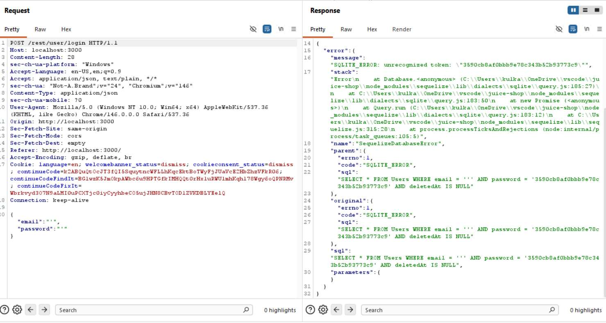
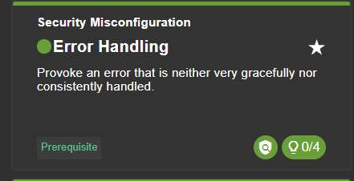

# Challenge 5: Error Handling

**Category:** Security Misconfiguration  
**Severity:** Medium

## Reason
Stack trace exposure reveals DB type and query structure, aids targeted injection attacks.

## Methodology

On the login page, provoked an error by inserting `'` in both the login and password parameters. This breaks the existing SQL query.

In Burp Suite, the full stack trace was visible in the response, including the raw SQL query, file paths, and database type.

The challenge was solved.

## Vulnerability Explanation

Since errors are not handled server-side, the raw SQL error is exposed directly in the UI, leaking internal implementation details such as the query which processes login, how it validates credentials, and the fact that it uses SQLite. We can also see that the error is in `query.js`, which provides the attacker with a technical roadmap of the application's internal structure and vulnerabilities.

## Impact

Exposed stack traces and SQL errors reveal the database type, query structure, and backend technology, giving an attacker the information needed to craft precise injection payloads. Attackers can also fine-tune SQLi attacks, eliminating time-consuming blind probing.
