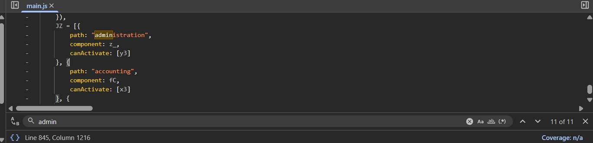

# Challenge 6: Login Admin

**Category:** Injection  
**Severity:** Critical

## Reason
Authentication bypass via SQLi grants full admin access with no credentials.

## Methodology

First, broke the SQL query by putting `'` in username and password, it triggered an error. Then put `' OR 1=1--` in the username field and a random string in the password (it gets commented out anyway).



## Vulnerability Explanation

The default query for retrieval of user data is:

```sql
SELECT * FROM users WHERE username = 'your_username' AND password = 'your_password';
```

When `' OR 1=1--` is put in the username field, the query is modified as follows:

```sql
SELECT * FROM users WHERE username ='' OR 1=1-- your_username' AND password = 'your_password';
```

The highlighted part is commented out (`--` comments out the rest of the code), and since the `WHERE` clause evaluates to true for every row, the database returns the first user in the table, which happens to be admin.

## Impact

An attacker can bypass authentication entirely and gain unauthorized access to any account including admin, extract sensitive user data, or perform destructive database operations depending on the permissions of the underlying DB user.
