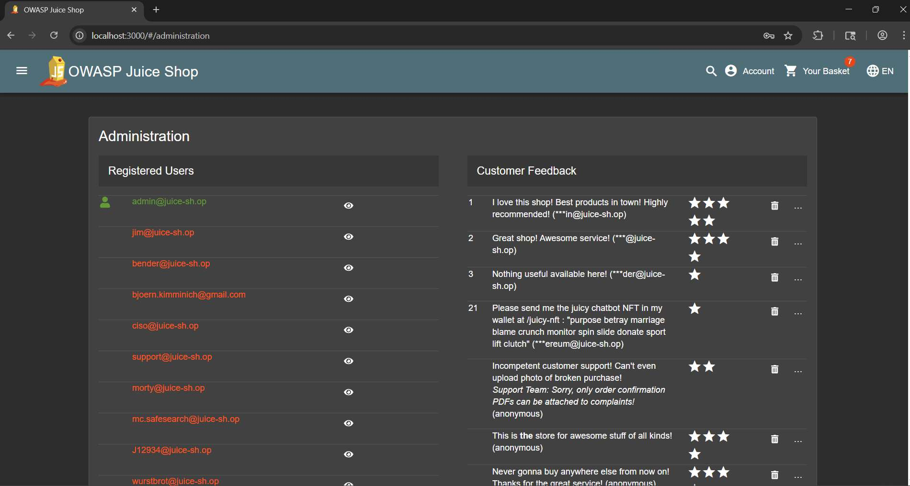

# Challenge 7: Admin Section

**Category:** Broken Access Control  
**Severity:** High

## Reason
Unauthenticated access to admin panel via route enumeration, no server-side role check.

## Methodology

After getting into the admin account via SQL injection, opened developer tools. In `main.js`, searched for `"admin"` using `Ctrl+F`.

Found the `/administration` path. Navigated to it directly.

Final URL: `http://localhost:3000/#/administration`

The admin panel was fully accessible.

## Vulnerability Explanation

The admin panel URL is not linked anywhere in the application UI, however it is easily discoverable via client-side route enumeration in `main.js`. The endpoint does not enforce server-side role checks. The application relies on obscurity rather than enforcing role-based access controls on the endpoint itself.

## Impact

Attacker can enumerate routes via `main.js` to discover the admin panel directly, and can gain admin privileges such as viewing all registered users, deleting feedback, and performing privileged actions.
