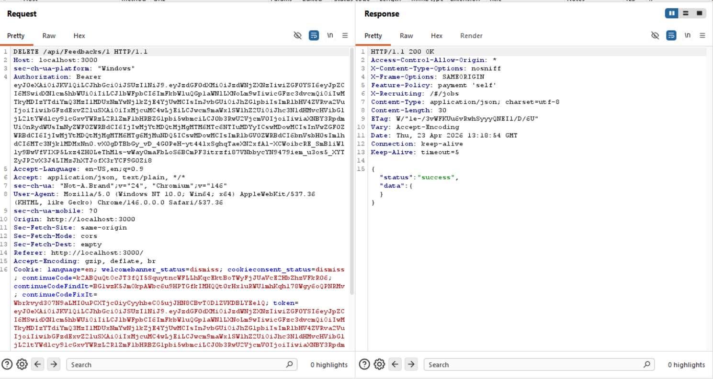
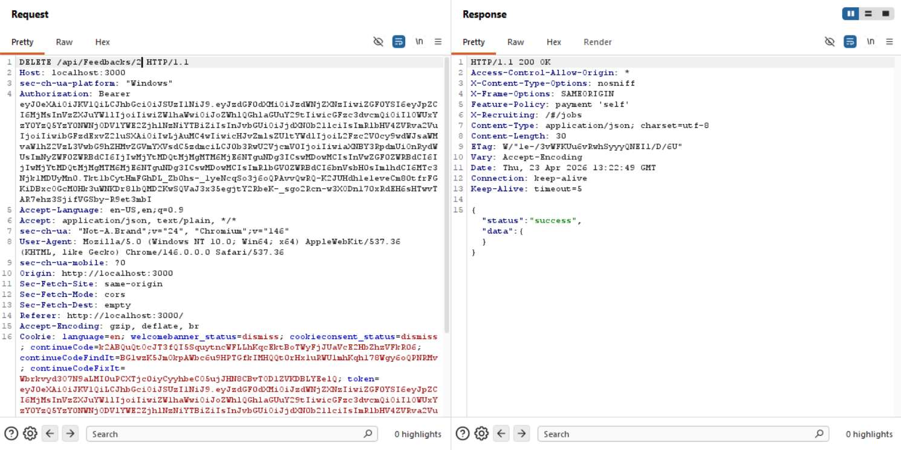
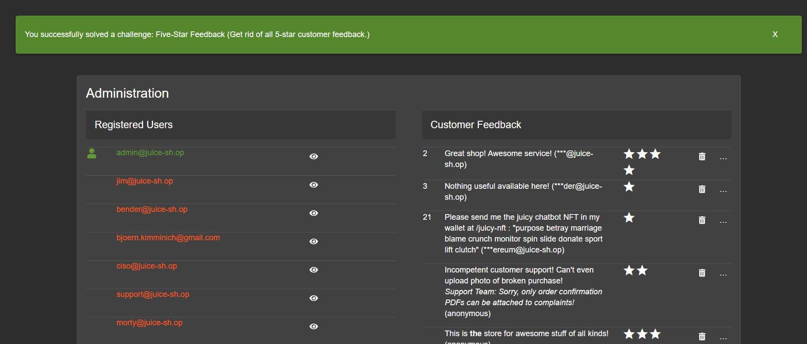

# Challenge 8: Five-Star Feedback

**Category:** Broken Access Control  
**Severity:** Medium

## Reason
Missing authorization on DELETE endpoint allows any authenticated user to delete feedback.

## Methodology

After accessing the admin page, clicked the delete option on the five-star reviews and observed the request in Burp Suite.

This solved the challenge. Out of curiosity, I then replayed the request by swapping the admin's JWT with a normal user's JWT to test if the server actually validates privileges.

It worked proving that the server does not initiate any check on deleting feedback.

## Vulnerability Explanation

The server does not have an authorization check on the DELETE endpoint. Any user can delete comments. The server never checks if the token has admin privileges.

## Impact

Any authenticated user can delete any feedback and make the business look bad, instead of only admin handling the feedback. Attackers can iterate through the `/:id` endpoint and perform mass deletion by writing an automated script.
