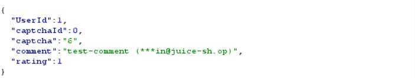
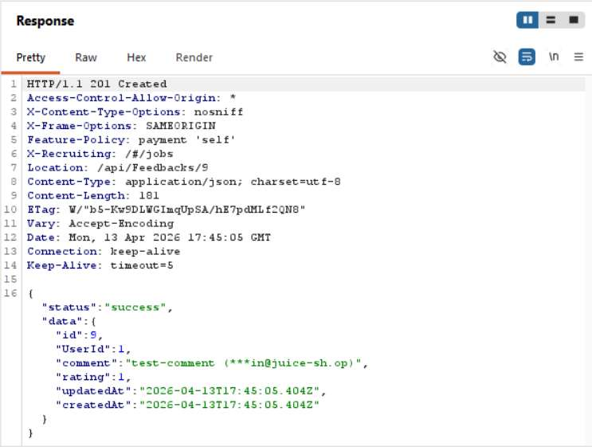
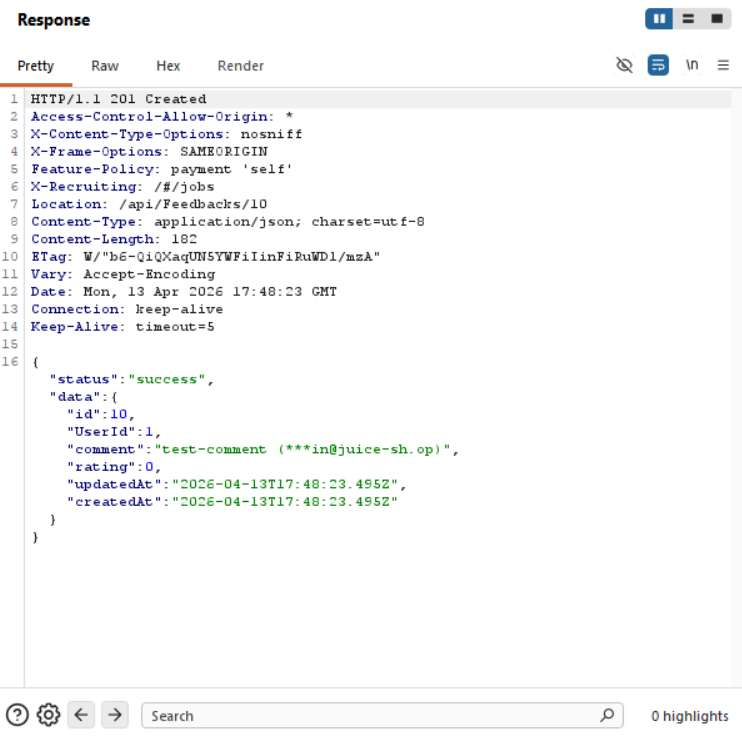
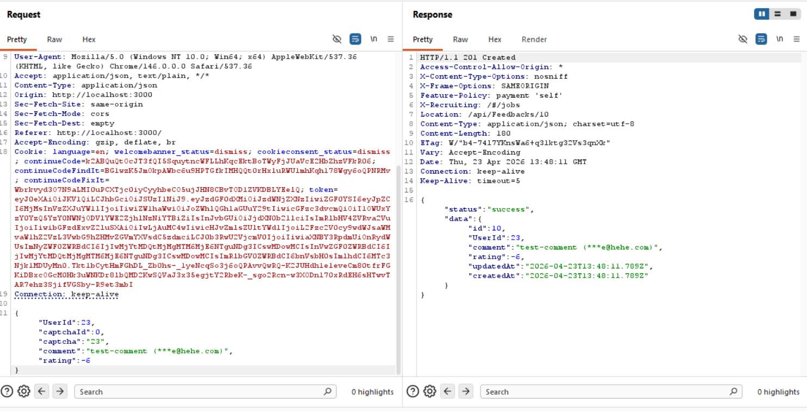
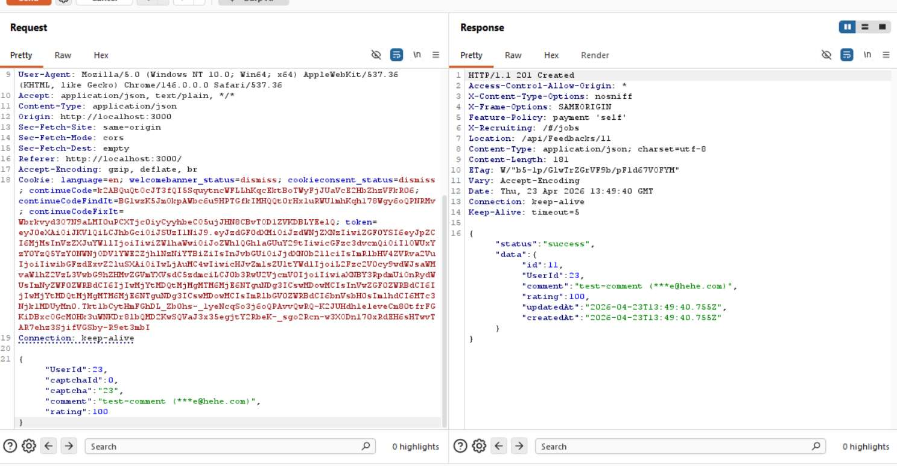

# Challenge 9: Zero Stars

**Category:** Improper Input Validation  
**Severity:** Low

## Reason
Client-side input validation bypass with no direct user harm, degrades data integrity only.

## Methodology

After getting into the admin account, went to the contact section at `http://localhost:3000/#/contact`. There are three parameters in the UI: comment, rating, and captcha.

Submitted a legitimate feedback request and observed it in Burp:

Sent the request to Burp Repeater and set the rating parameter to `0`.

Submitted the zero-rating comment and the challenge was solved.

Going further, I also tested with negative integers and very large numbers to see how the application handles out-of-range values.

Both were accepted successfully.

## Vulnerability Explanation

Comment details are sent via JSON to the server. By intercepting the feedback request in Burp, the rating parameter can be modified to any integer value before sending it to the server. The frontend restricts rating to 1-5 via UI controls, but the API performs no server-side validation on the rating field, allowing any integer value to be submitted directly.

## Impact

An attacker can send mass zero ratings and sabotage business operations, or manipulate ratings in the other direction to artificially flood 5-star reviews and boost products. An attacker can also send any integer value as a rating, making the feedback section meaningless as the rating system loses all integrity and becomes unreliable for users.
