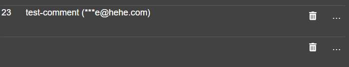
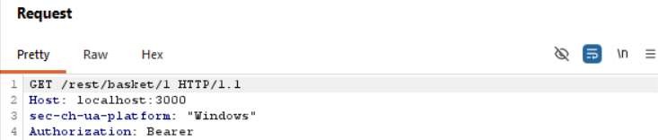

# Challenge 10: View Basket

**Category:** Broken Access Control  
**Severity:** High

## Reason
IDOR exposes other users' shopping data, privacy violation with social engineering potential.

## Methodology

Viewed `http://localhost:3000/#/basket` and observed the request in Burp Suite. Found that it hits the `/rest/basket/1` endpoint.

Sent the request to Burp Repeater, changed the endpoint to `/rest/basket/2`, and sent the request and I viewed another user's shopping basket.

## Vulnerability Explanation

When a user accesses their own basket, the basket ID is passed as a parameter in the request URL. There is no server-side check implemented while accessing a basket and the server should verify that the basket ID in the request matches the authenticated user's session, but no such check exists. Changing the ID from `1` to `2` accesses other users' baskets.

## Impact

Attackers can iterate the endpoint such as `/1`, `/2` and so on and access other people's baskets. This is a significant privacy violation and attackers can frame social engineering attacks to scam a user by making a pattern out of a person's interests.
