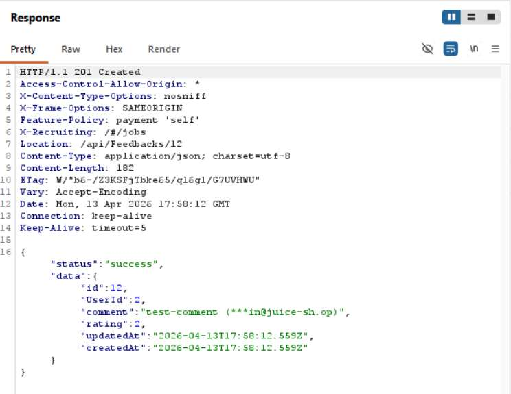
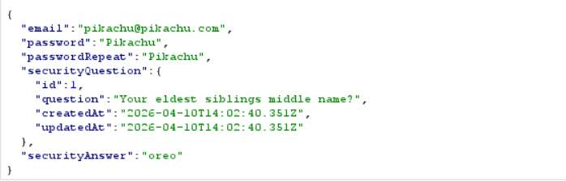

# Challenge 12: Admin Registration

**Category:** Improper Input Validation  
**Severity:** Critical

## Reason
Mass assignment vulnerability allows self-elevation to admin role during registration.

## Methodology

Created a new account and observed the request in Burp:

Sent the request to Burp Repeater, changed the email, appended a `role` parameter set to `"admin"`, then sent the request.

Got admin privileges.

## Vulnerability Explanation

When an account is created, the default user role is assigned. When we intercept the create-account request and add the `role` parameter set to `"admin"`, it overrides the existing role parameter and admin privileges are granted. The API accepts and processes additional parameters beyond what the frontend sends, including hidden fields like `role`. The server should have a whitelist of allowed fields for the registration endpoint and any field outside that list should be rejected or ignored.

## Impact

Since there is no server-side validation rejecting unexpected or privileged fields, an attacker can mass assign themselves any role during registration. Attackers can gain admin privileges such as viewing all registered users, deleting feedback, and performing privileged actions.
