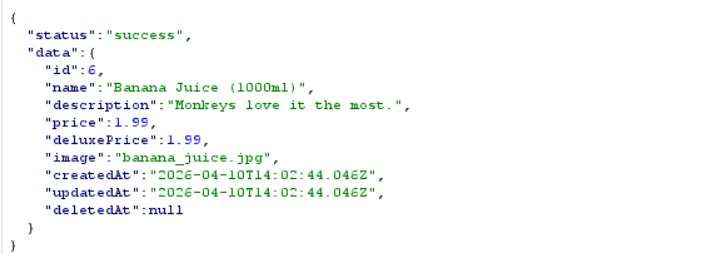
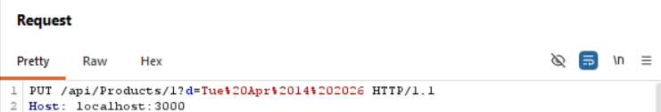
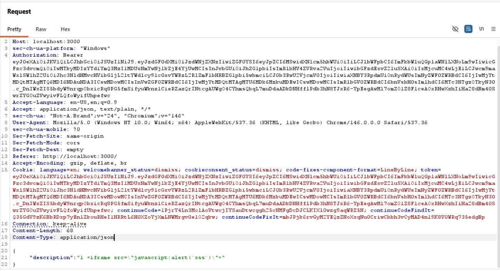
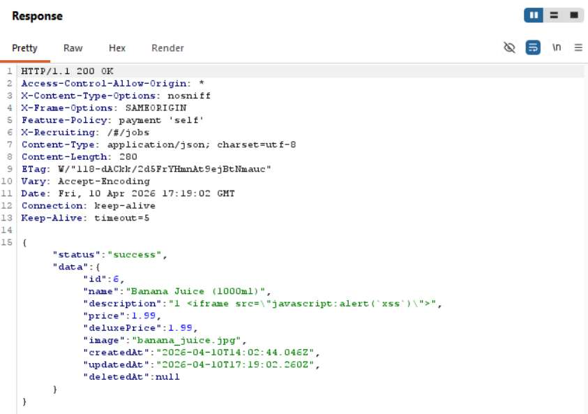

# Challenge 13: API-based XSS

**Category:** XSS  
**Severity:** Critical

## Reason
Stored XSS in product description fires for every user who views the product, admin takeover possible.

## Methodology

First, viewed an item and examined the request in Burp to understand the product data structure.



Sent the request to Burp Repeater. Modified the description field with a JS payload and changed the request method to `PUT`. Set `Content-Type` to `application/json`.

```json
{
  "description": "1 <iframe src=\"javascript:alert(`xss`)\">""
}
```



The response confirmed the payload was stored.



Challenge solved.



## Vulnerability Explanation

This endpoint suffers from stored XSS. Stored XSS is more dangerous than reflected XSS because the payload is persisted in the database, so every time a user visits the product description, the alert fires without any user interaction required. The frontend restricts user input, preventing malicious payloads from being submitted through the UI. However, by sending a PUT request directly to the API with `Content-Type: application/json`, the frontend validation is bypassed entirely. The API accepts and stores the unsanitized payload in the description field, which is later rendered as HTML on the product page, causing the script to execute in the user's browser.

## Impact

By injecting malicious payloads into product descriptions via direct API calls, one successful stored XSS attack affects every user who views the product until it is removed. This also plays a huge role in redirecting to phishing sites, admin account takeover, and enabling session hijacking.
