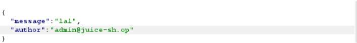
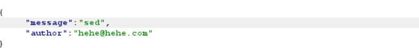

# Challenge 14: Forged Review

**Category:** Broken Access Control  
**Severity:** Medium

## Reason
Author field not validated against JWT, enables review impersonation.

## Methodology

Clicked on a product, submitted a comment, and observed the request in Burp:

```json
{
  "message": "lal",
  "author": "admin@juice-sh.op"
}
```

Sent to Burp Repeater and edited the message and author parameter:

```json
{
  "message": "sed",
  "author": "hehe@hehe.com"
}
```



The response was `{"status":"success"}`.



## Vulnerability Explanation

The review on the product is sent as a JSON document to the server. The author is included in the JSON document. But if the author is changed via intercepting the legitimate request, the server still treats it as an authorized request. The server should verify whether the author field in the request body matches the user's identity in the JWT token, but it doesn't. It trusts whatever value is sent in the author field.

## Impact

An attacker can impersonate any user and post or edit reviews under their identity, without their knowledge. This can be used to damage a specific user's reputation, plant false reviews, or manipulate product ratings. Since the server has no authorization check on the author field, it is undetectable from the server's perspective.
