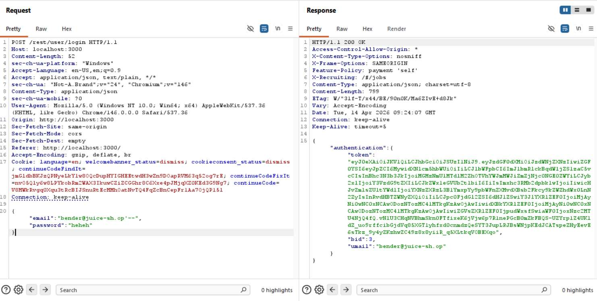

# Challenge 15: Login Bender

**Category:** Injection  
**Severity:** Critical

## Reason
SQLi authentication bypass using known email, no credentials needed for account takeover.

## Methodology

Retrieved Bender's email from the product reviews. Intercepted the original login request and sent it to Burp Repeater. Entered the valid email in the email parameter and commented out the password parameter.

Payload in email field: `bender@juice-sh.op'--`  
Password: any string



Sent the request and the challenge solved.


## Vulnerability Explanation

Since the login endpoint doesn't sanitize input, we can use `'--` to bypass the password validation. The default query for retrieval of data is:

```sql
SELECT * FROM users WHERE email = 'your_email' AND password = 'your_password';
```

In this case, the query becomes:

```sql
SELECT * FROM users WHERE email = 'bender@juice-sh.op'-- AND password = 'your_password';
```

The highlighted text gets commented out and as the email exists in the database, the query returns the user and login succeeds without password validation.

## Impact

An attacker can impersonate any user whose email is known without needing credentials. This can lead to further attacks such as social engineering attacks. Most emails are discoverable via the application itself through product reviews and feedback.
