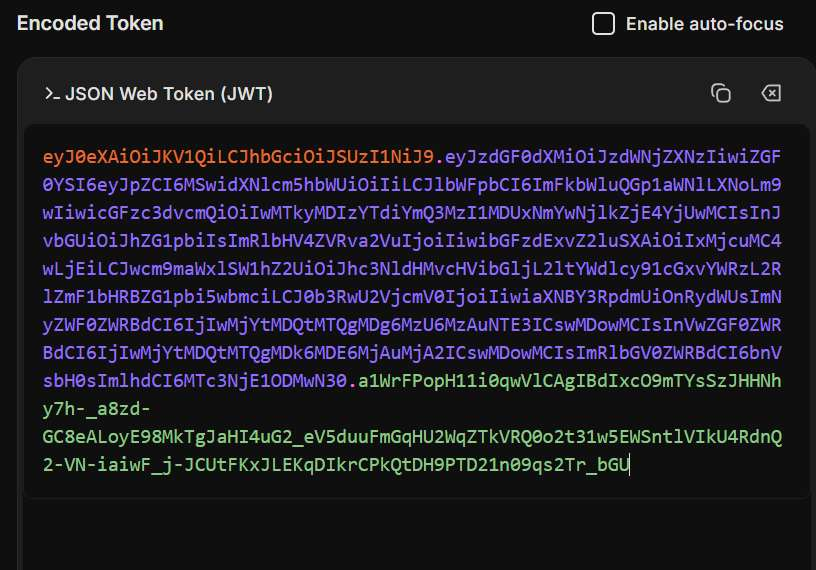
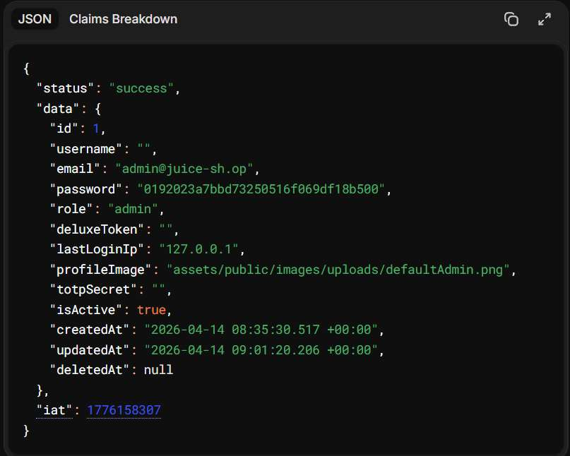
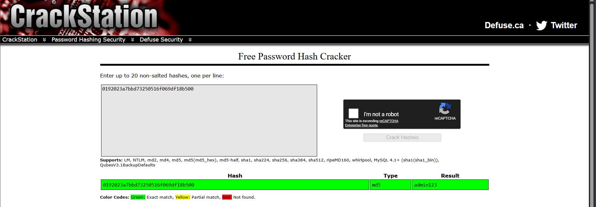
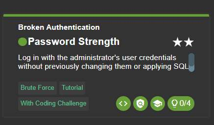

# Challenge 16: Password Strength

**Category:** Broken Authentication  
**Severity:** High

## Reason
Weak unsalted MD5 password cracked via public rainbow tables, admin account compromised.

## Methodology

Used `' OR 1=1--` to login into the admin account and copied the JWT token. Decoded it at [jwt.io](https://jwt.io) and it decoded into a JSON document containing the admin's hashed password.

The password is stored as a hash. Used CrackStation to decode the hash using the MD5 algorithm.

Cracked password: `admin123`

Logged in with `email: "admin@juice-sh.op"` and `password: "admin123"` and the challenge was solved.

This challenge can also be solved by brute-forcing with a proper wordlist.

## Vulnerability Explanation

The admin account uses a weak, commonly known password stored as an unsalted MD5 hash. Unsalted hashes are vulnerable to precomputed dictionary attacks and rainbow tables, allowing attackers to crack multiple passwords simultaneously using tools like CrackStation.

## Impact

Even if a system is not vulnerable to different types of code vulnerabilities like SQLi, weak passwords represent a credential vulnerability that persists even on otherwise hardened systems. Weak passwords can be looked up online or cracked using brute-forcing, which leads to full account takeover. In this case, the admin account is taken over, exposing user data and privileged functionality. The broader risk is that a person can reuse the same password across many other accounts, leaving other systems vulnerable.
