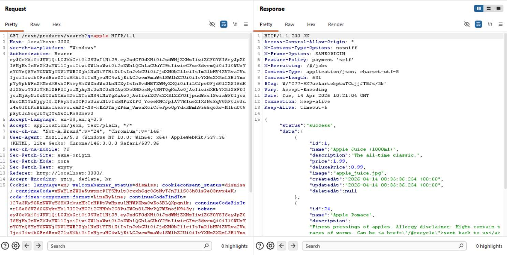
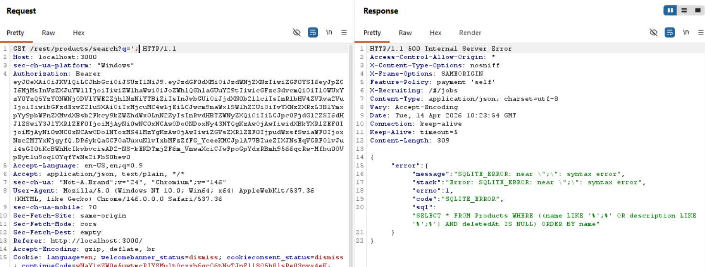
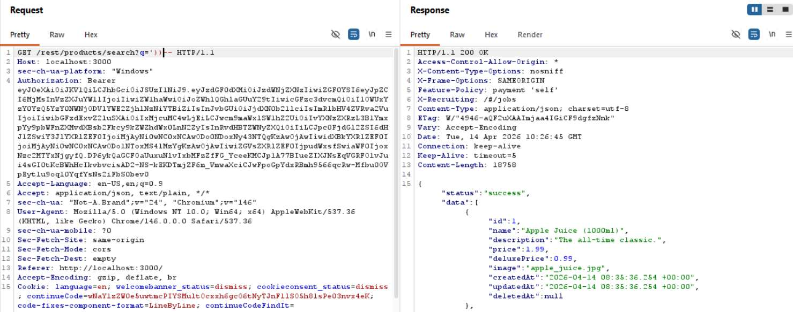

# Challenge 17: User Credentials

**Category:** Injection  
**Severity:** Critical

## Reason
UNION-based SQLi exfiltrates all user emails and password hashes from the database.

## Methodology

In the search field at `http://localhost:3000/#/search?q=`, searched `apple` and observed the request in Burp and it returned results matching the query.

Tried `'` and it broke the SQL query and returned an error exposing the query structure.


Closed the existing query using `'))--`, which commented out the rest of the code and returned results successfully.

Then clubbed it with a UNION query — got a column count mismatch error.



Enumerated the number of columns by incrementing until finding the right count.



Once the column count matched, replaced placeholder strings with `email` and `password` to extract credentials from the Users table.

Final payload:
```
'))UNION+SELECT+email,password,'3','4','5','6','7','8','9'+FROM+USERS--
```



Challenge solved.

## Vulnerability Explanation

This uses UNION-based SQLi. The UNION operator requires a matching column count because it is designed to combine results from multiple queries vertically, stacking rows from one dataset onto another. As the search endpoint uses SQL queries to retrieve data, we can use SQLi to extract data we are not supposed to access.

The process:
1. Break the SQL query using `'`
2. Get error information about how the query is constructed
3. Use `'))--` to close the existing query and comment out the rest
4. Use UNION-based SQL and enumerate columns to match the original query's count
5. Replace placeholder strings with `email` and `password` to extract credentials from the Users table

## Impact

An attacker can inject malicious SQL queries and exfiltrate the entire database including credentials of all users. This can lead to a breach of PII of customers and employees, which could lead to further social engineering attacks. Password hashes can be cracked using tools like hashcat, leading to account takeover. A massive database dump will lead to distrust between customers and the entity, breach of confidentiality, legal troubles, massive financial penalties, and reputational damage to the organisation.
