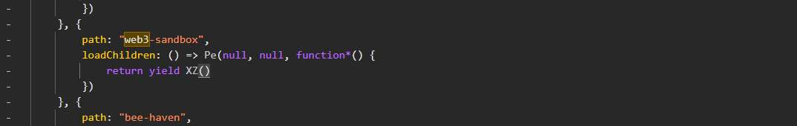
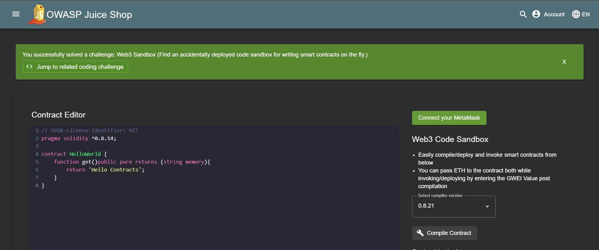

# Challenge 18: Web3 Sandbox

**Category:** Broken Access Control  
**Severity:** Medium

## Reason
Accidentally deployed dev feature publicly accessible, enables smart contract tampering.

## Methodology

In dev tools under Sources, found the `web3` path inside `main.js`.

Entered the path in the URL. Final URL: `http://localhost:3000/#/web3-sandbox`

Challenge solved.

## Vulnerability Explanation

In this case, the web3 instance is an accidentally deployed feature in production and it is found via client-side enumeration in `main.js`. This path is visible to any unauthenticated user. A web3 sandbox allows developers to build, test, and debug dApps and smart contracts in a safe isolated environment and potentially make transactions. Unauthenticated access can lead to potential threats like code tampering and stealing of intellectual property.

## Impact

If a web3 instance is made publicly available, anyone can read blockchain data, execute smart functions, or even potentially send unauthorized transactions if private keys are not properly secured.
