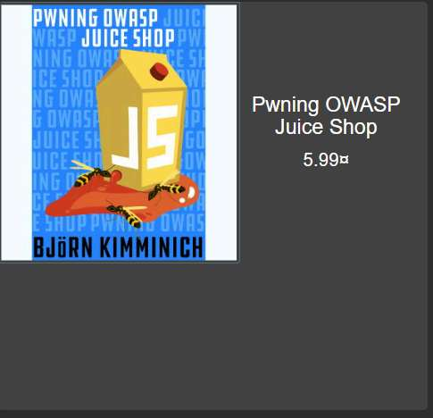
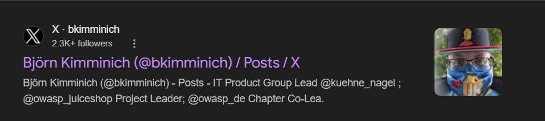
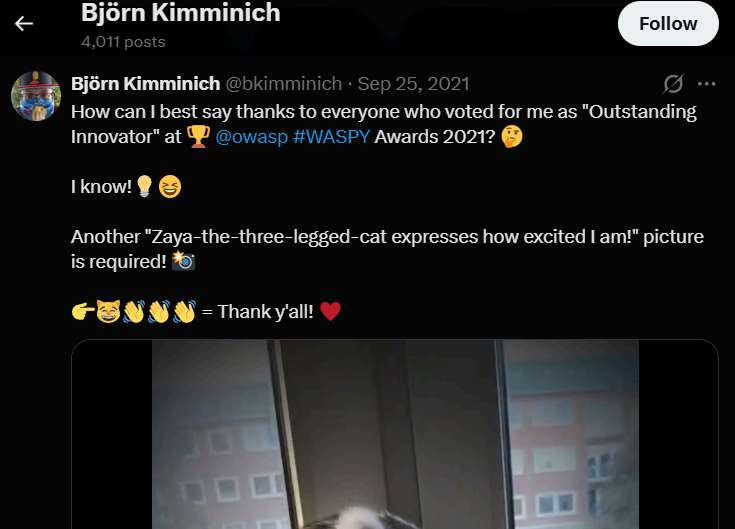
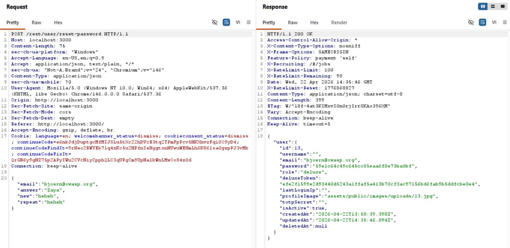
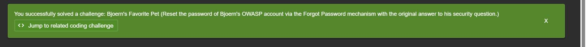

# Challenge 19: Bjoern's Favorite Pet

**Category:** Broken Authentication  
**Severity:** High

## Reason
Security question answerable via public OSINT, full account takeover without credentials.

## Methodology

Found Bjoern's email from the product reviews: `bjoern@owasp.org`. In juice-shop, found the following product.

Needed to guess the answer to his security question. Searched for Björn Kimminich on Google and found his Twitter/X handle `@bkimminich`.

Scrolled through his posts and found a tweet from 5 years ago mentioning his three-legged cat named Zaya.

Tried `Zaya` as the answer to the security question and it worked.

Challenge solved.

## Vulnerability Explanation

The entire password reset is dependent on a security question, which is answerable through public OSINT. A security question as a password reset mechanism is a design flaw. These are guessable because they're tied to real-world personal information that people naturally share. In this case, Bjoern had a product with his full name on the Juice Shop page. Googling the person's full name displays his social media handles, then scrolling through his posts reveals his cat's name, Zaya.

## Impact

Attackers can take over the account purely using social engineering attacks and public information. Modern AI algorithms can analyze a person's behaviour using publicly available information as a dataset and make social engineering attacks customized.
