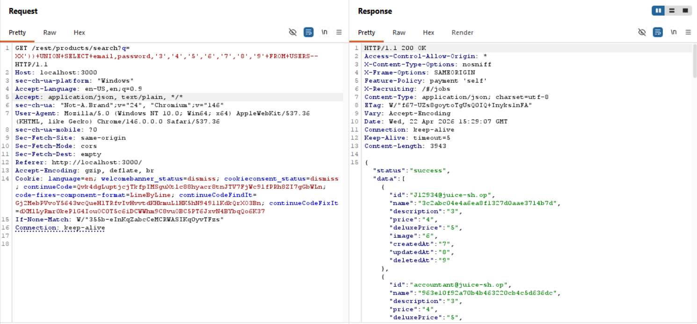
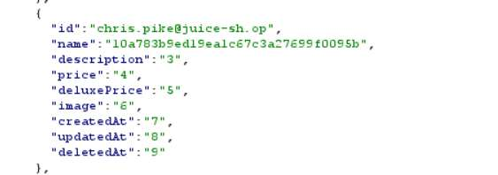
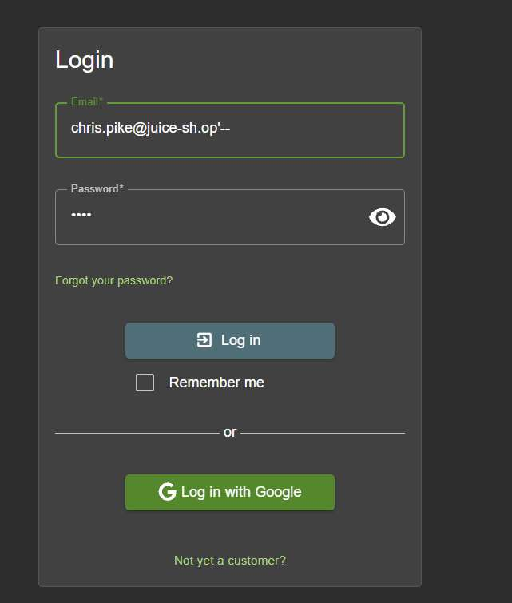

# Challenge 20: GDPR Data Erasure

**Category:** Broken Authentication  
**Severity:** High

## Reason
Soft deletion retains credentials as valid for auth, violates GDPR Article 17.

## Methodology

Reused the UNION-based SQLi payload from the User Credentials challenge to retrieve all user data:

```
XX'))+UNION+SELECT+email,password,'3','4','5','6','7','8','9'+FROM+USERS--
```


Scrolled through the retrieved data and found Chris's credentials.



Used SQL injection to login into Chris's account: `chris.pike@juice-sh.op'--`



Challenge solved.


## Vulnerability Explanation

After reusing the existing payload, we logged into the ghost account using SQLi by appending `'--` to the email field, commenting out the password validation. Accounts are not fully purged after deletion and credentials remain valid for authentication. This is known as soft deletion, which makes credentials hidden but not deleted. This violates the GDPR's Right to Erasure (Article 17), which requires erasure of personal data upon request.

## Impact

SQLi is a code vulnerability which can retrieve data of all users without consent and credential exfiltration. Soft deletion hides data from public view, but it can still be accessed by internal people in organizations such as employees and administrators, which is a GDPR violation. Deleted users can still authenticate. The combination of both vulnerabilities means an unauthenticated user can see the deleted user's data and exposure of this data can result in legal troubles to the organization. GDPR violations can result in fines up to 4% of annual global turnover under Article 83.
