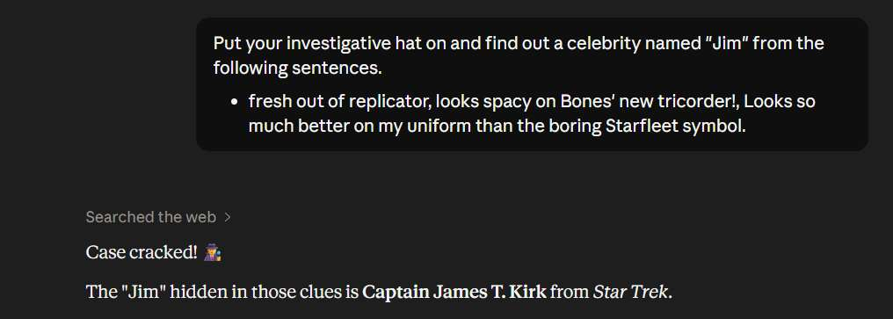

# Challenge 21: Reset Jim's Password

**Category:** Broken Authentication  
**Severity:** High

## Reason
Security question derivable via OSINT and AI-assisted enumeration, account takeover possible.

## Methodology

Jim's email is `jim@juice-sh.op`. Typed it into the forgot-password page and found his security question: "Your eldest sibling's middle name?"

Tried several famous celebrities named Jim such as Jim Carrey, Jim Parsons, Jim Stewart, Jim Morrison, Jim Croce and none worked.

Changed approach: went through all comments posted by Jim in the Juice Shop. Found these reviews:

- *"Fresh out of a replicator."*
- *"Looks spacy on Bones' new tricorder!"*
- *"Looks so much better on my uniform than the boring Starfleet symbol."*

Prompted an AI to identify the person from the clues:

The AI identified the character as Captain James T. Kirk from Star Trek. Googled his brother's name and found it in the Wikipedia page — **Samuel**.

Submitted "Samuel" as the answer to the security question and successfully changed the password.

Challenge solved.

## Vulnerability Explanation

The forgot password mechanism relies on a security question which is guessable. This is a poor design flaw because the answer is derivable using publicly available information and AI tools to find clues using account references. In this case, going through the comments posted by Jim on the website, we find Star Trek references in his reviews. Prompting an AI with those references identified the character as Captain James T. Kirk. Then Googling his brother's name leads to the answer.

## Impact

Attackers can take over the account purely using social engineering attacks and public information. AI algorithms can analyze a person's behaviour using publicly available information as a dataset and make social engineering attacks customized. In this case, the AI analyzed the comments posted by the victim and pointed out his actual character which led to knowing his brother's name and that led to account takeover.
