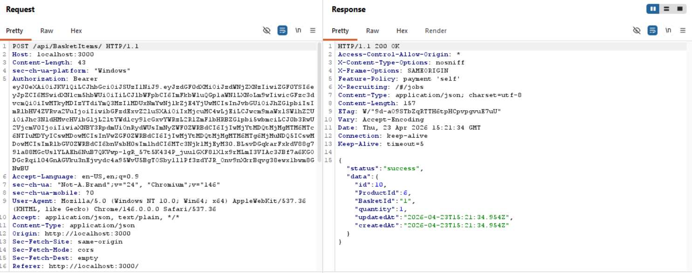
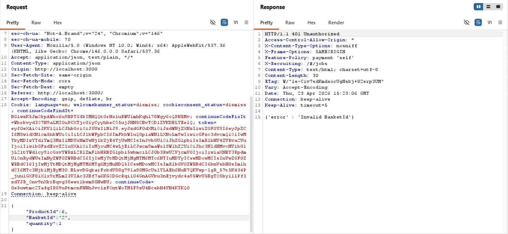
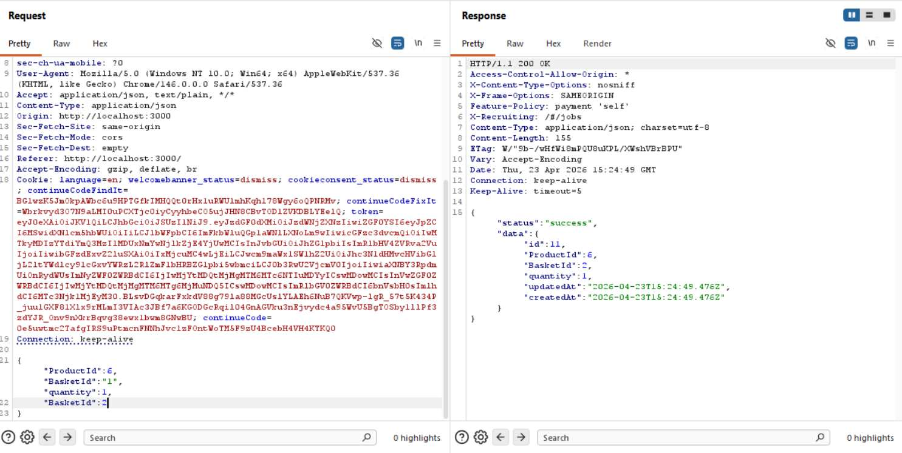

# Challenge 22: Manipulate Basket

**Category:** Broken Access Control  
**Severity:** High

## Reason
HTTP Parameter Pollution bypasses basket ownership check, enables unauthorized purchases on the victim's account.

## Methodology

Added an item to my basket and examined the request in Burp Suite.

Sent to Burp Repeater and tried changing the basket ID and got a 401 Unauthorized error.

Added a duplicate `BasketId` parameter and tried sending the request.

It worked. Verified by accessing userId 2's basket to confirm the product was added.

Challenge solved.

## Vulnerability Explanation

HTTP Parameter Pollution (HPP) is a vulnerability occurring when an application improperly handles multiple HTTP parameters with the same name, allowing attackers to override parameters, bypass validation, or manipulate application logic. In this case, the `BasketId` parameter is overridden as the server selects the last occurrence. The first parameter passes the server's initial validation check, while the second overrides the actual basket being accessed.

## Impact

An attacker can add products to another person's cart, causing them financial harm or making embarrassing purchases from their account.
