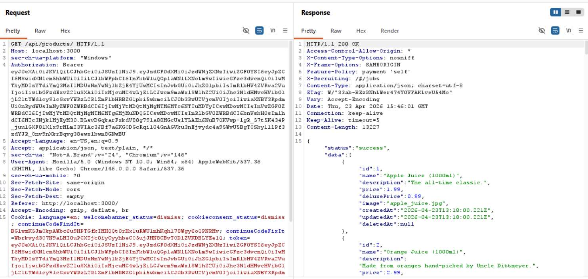
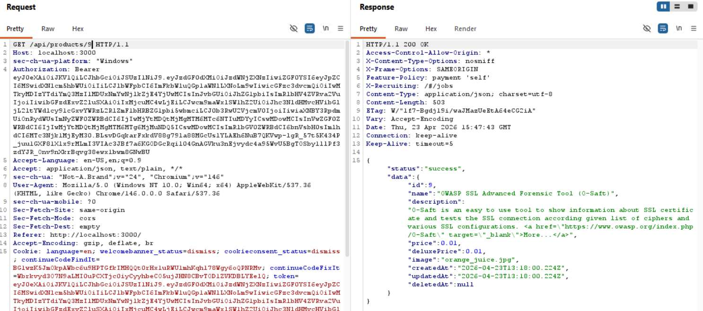
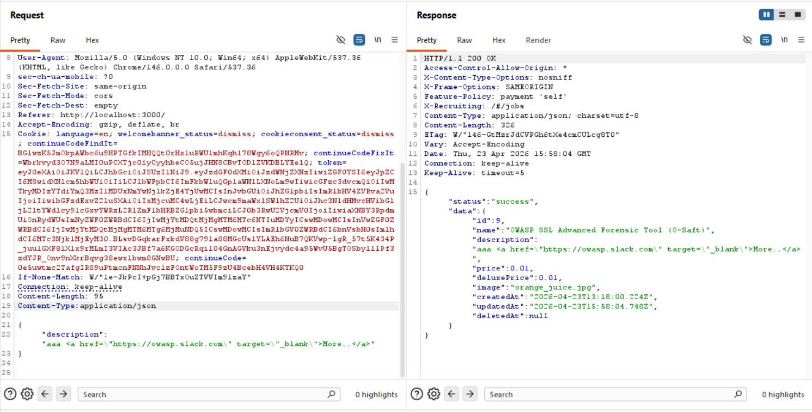
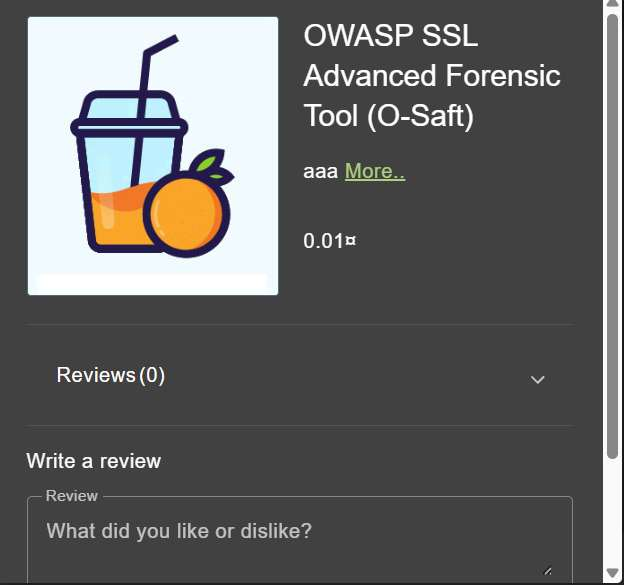

# Challenge 23: Product Tampering

**Category:** Broken Access Control  
**Severity:** Medium

## Reason
Unauthenticated PUT on product endpoint allows HTML injection and link manipulation.

## Methodology

To find the target product's ID, requested the `/api/products` endpoint and went through the title of each product.



Found the target product (OWASP SSL Advanced Forensic Tool) has ID 9. Requested that specific product in Burp Suite.



The endpoint is vulnerable to HTML injection (same as the API-based XSS challenge). Changed the request method from GET to PUT, changed `Content-Type` to `application/json`, and added the description parameter with the target link:

```json
{
  "description": "aaa <a href=\"https://owasp.slack.com\" target=\"_blank\">More..</a>"
}
```



Verified that the redirect link changed in the UI.



Challenge solved.


## Vulnerability Explanation

The API endpoint accepts multiple HTTP methods without proper authorization checks. The endpoint is vulnerable to HTML injection and by sending a PUT request directly to the API with `Content-Type: application/json`, the frontend validation is bypassed entirely. The API accepts and stores the unsanitized content in the description field, which is rendered as HTML on the product page.

## Impact

An attacker can inject malicious HTML into product descriptions via direct API calls, replacing legitimate links with attacker-controlled URLs. This can be used for phishing attacks, credential theft, or directing users to malware distribution sites.
