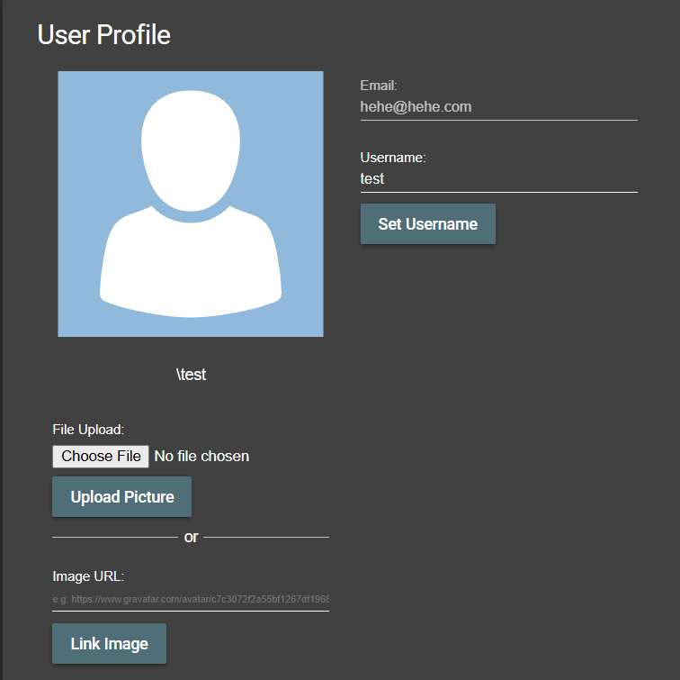

# Challenge 24: CSRF

**Category:** CSRF  
**Severity:** Medium

## Reason
Missing CSRF token and SameSite cookie protection allows cross-origin state-changing requests.

## Methodology

Created a simple HTML form that submits a POST request to the `/profile` endpoint and hosted it. When a logged-in victim visits the malicious page, it sends a username change request cross-origin to the server.

The username was changed successfully — challenge solved.

## Vulnerability Explanation

This endpoint is vulnerable to CSRF as the `/profile` endpoint accepts cross-origin requests without validating the origin or CSRF tokens. Modern browsers block this via `SameSite` cookies, but the application has no server-side protection. A simple HTML form which submits a POST request to `/profile` is created. When the victim visits the malicious page with an active login session, it sends the username change cross-origin request to the server. As the server doesn't have any protection against CSRF attacks, it processes this request.

## Impact

Attacker can perform silent actions on behalf of the logged-in victim. Attackers can also change passwords, email addresses, or account settings without the user's consent. By changing credentials, an attacker can lock the user out and gain whole control. If an administrator falls victim, an attacker can change application configuration, access sensitive data, or alter code.
