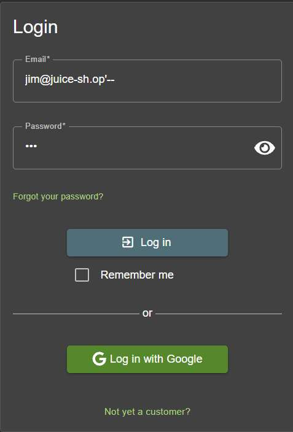
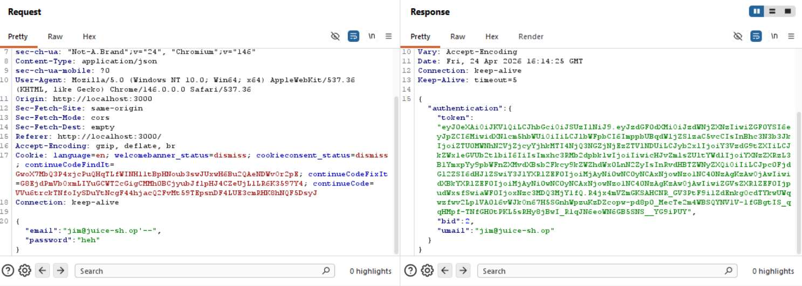

# Challenge 25: Login Jim

**Category:** Injection  
**Severity:** Critical

## Reason
SQLi bypass using publicly visible email, any commenter account is takeover-able.

## Methodology

Found Jim's email from product comments: `jim@juice-sh.op`

Applied the same SQLi technique used in previous login challenges.

Payload in email field: `jim@juice-sh.op'--`  
Password: any random string

Clicked login and the challenge was solved.

## Vulnerability Explanation

The login endpoint requires email and password. Jim's email is easily discoverable on the application because he leaves comments on products. Since the endpoint is vulnerable to SQL injection, appending `'--` to the email field comments out the SQL query which verifies the password. As the email is true, the query returns the user and login succeeds without password validation.

## Impact

Even without knowing credentials, an attacker only needs a publicly visible email to take over any account. Most emails are visible because users usually comment or give feedback on the product. This is a potential threat to all users who have commented, as an attacker can log into their account and pursue further attacks such as social engineering attacks.
