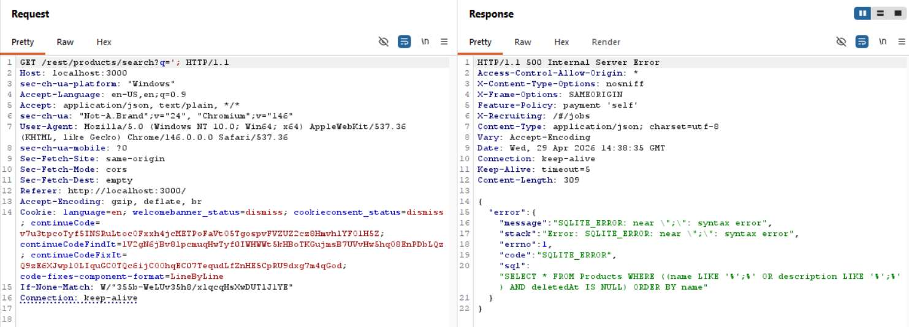
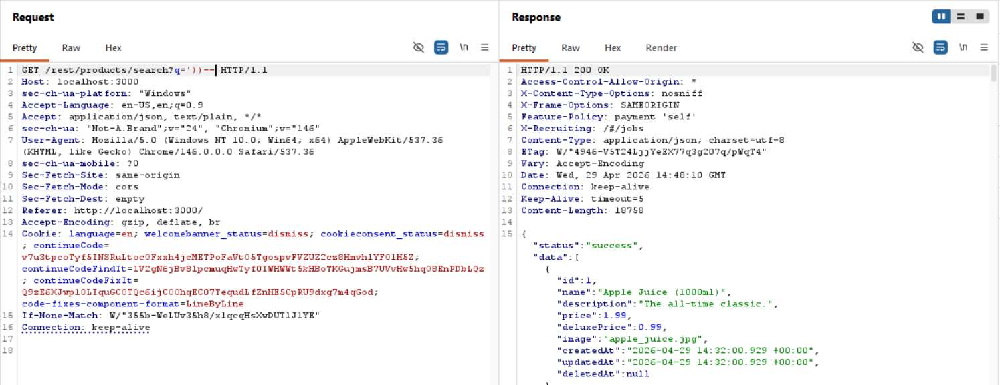
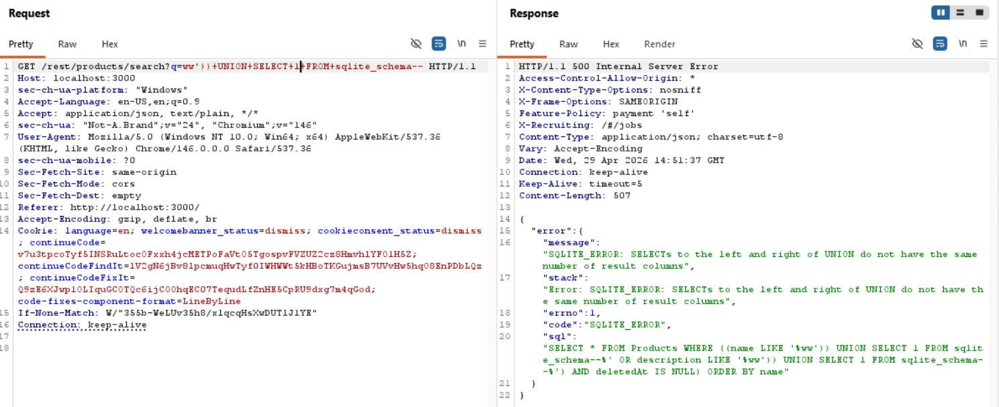
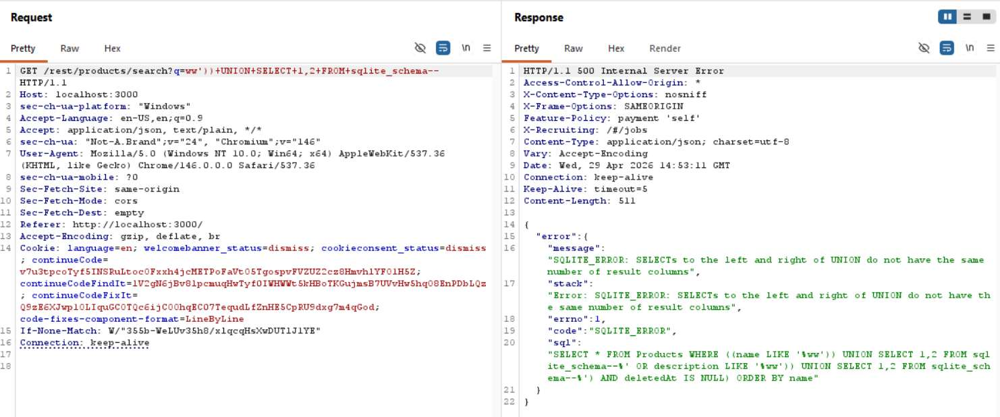

# Challenge 26: Database Schema

**Category:** Injection  
**Severity:** High

## Reason
UNION SQLi against search endpoint exposes full DB schema including table and column names.

## Methodology

The injection point is `/rest/products/search`. Identified it using `'` to break the query and get error output.

Closed the existing query using `'))--`.

Enumerated the number of columns using `UNION SELECT`. In SQLite, the `sqlite_schema` table (historically known as `sqlite_master`) stores DDL for all objects, so used it as the base table.

Got a syntax error on `sqlite_schema` and this implies the table is present.

Enumerated the correct column count by incrementing numbers.

Placed `sql` in one of the columns and got the full schema back, including `CREATE TABLE` statements.

Challenge solved.

## Vulnerability Explanation

The `/rest/products/search` endpoint passes the `q` parameter directly into a raw SQLite query without sanitization or parameterization. Because user input is processed directly, an attacker can arbitrarily inject SQL. The error responses expose the full query structure, confirming the injection, which can lead to further curated queries to extract data.

## Impact

An attacker can exploit the vulnerability to exfiltrate the database schema via `sqlite_schema`, which can reveal sensitive tables such as `Users`, `Addresses`, and any credential stores. Attackers can also extract user data such as emails, hashed passwords, and PII from the `Users` table using follow-up UNION-based queries. In a real application, a single endpoint could lead to full account takeover of every user, resulting in a major data breach.
