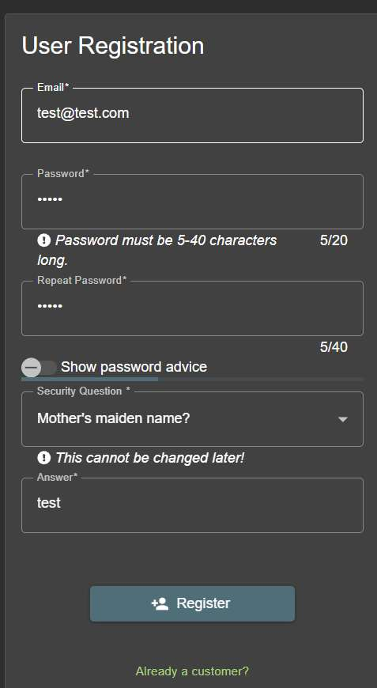
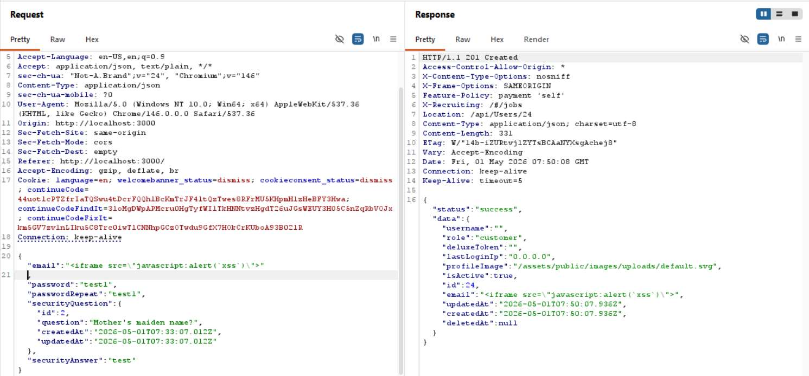

# Challenge 27: Client-side XSS Protection

**Category:** XSS  
**Severity:** Critical

## Reason
Stored XSS on admin panel via registration bypass, enables full admin session takeover.

## Methodology

Client-side validation is a UX feature, not a security control. Any validation enforced in the browser can be bypassed by intercepting the request in Burp.

Went to user registration, filled in dummy details, and clicked Register. Intercepted the POST request to `/api/Users/` in Burp Repeater.



In the email parameter, instead of a valid email, put an XSS payload:

```
<iframe src="javascript:alert(`xss`)">
```

Sent the request.



Logged into the admin account and visited the administration panel — the XSS fired.


Challenge solved.

## Vulnerability Explanation

The application only enforces input validation on the client-side using JavaScript. The email field in the registration form only rejects non-email strings in the browser, but the server-side `/api/Users` endpoint performs no sanitization. By intercepting the POST request in Burp and replacing the email parameter value with `<iframe src="javascript:alert(`xss`)">`, the payload is accepted and stored in the database. When an admin views the user list at `/administration`, the stored payload is executed in their browser. This is a stored XSS and the payload survives across sessions for any user who renders the data.

## Impact

As the admin panel is the highest-privilege surface in the application, a stored XSS here means full admin session takeover is possible. An attacker who registers with a malicious email payload can hijack the admin's session, exfiltrate cookies, perform privileged actions, or maintain persistent access to the application's administration functionality.
